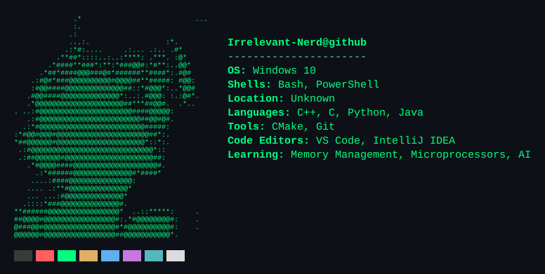

  

### **`More About Me`**
- `I'm a self-taught developer, I start writing code at age of 17`
- `I use C++ and C for low-level programming`
- `I use Python for AI development`
- `I also write code in Java because my University requires it`
- `I use VS Code and IntelliJ IDEA as my main code editors`
- `Quite comfortable working with CMake and Git`
- `Still learning and exploring new stuff`

---

### **`Languages`**

### **`Tools`**

### **`Code Editors`**

---

